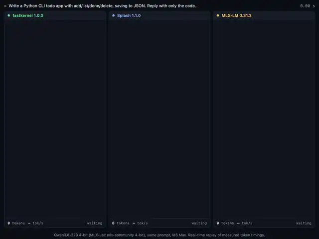
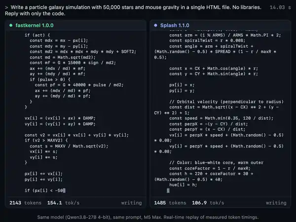
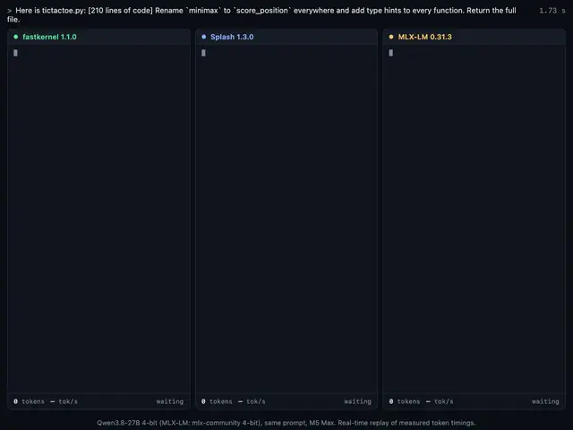
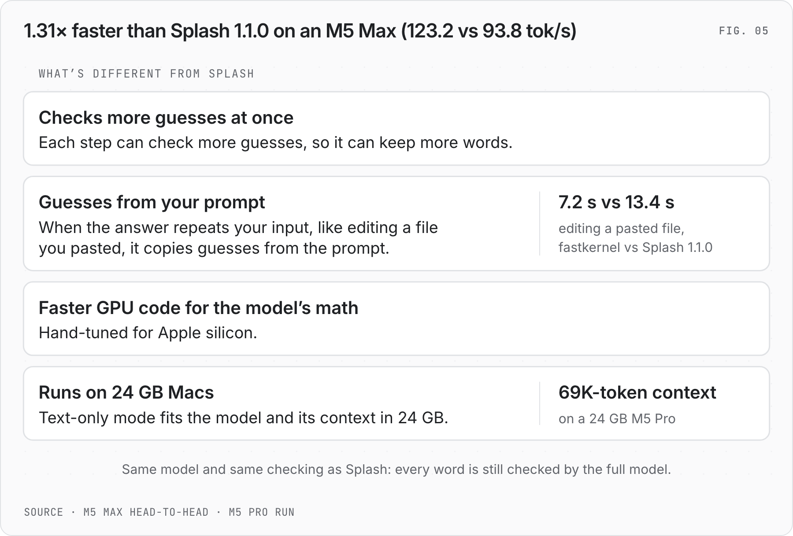

<!-- Modified by meowkernels. (Splash's original README is docs/SPLASH-README.md.) -->
<h1 align="center">fastkernel</h1>

<p align="center"><b>The fastest inference engine for Qwen3.8-27B and Qwen3.6-35B-A3B on Apple Silicon.</b><br>
1.31× faster than Splash 1.1.0 on an M5 Max · every token still checked by the full model</p>

<p align="center"><a href="docs/media/speed-race.mp4"></a><br>
<sub><b>Same prompt, same 708-token answer:</b> fastkernel 3.97 s · Splash 1.1.0 5.31 s · MLX-LM 24.9 s.
<a href="docs/media/speed-race.mp4">Video</a></sub></p>

<p align="center"><a href="docs/media/galaxy-app.mp4"></a><br>
<sub><b>Building a particle galaxy app in one shot:</b> 3,044 tokens in 19.6 s for fastkernel vs 29.7 s for Splash
1.1.0, then the galaxy fastkernel wrote runs in Chrome. <a href="docs/media/galaxy-app.mp4">Video</a></sub></p>

<p align="center"><a href="docs/media/code-edit.mp4"></a><br>
<sub><b>Editing a pasted 210-line file:</b> fastkernel 7.2 s · Splash 1.1.0 13.4 s · MLX-LM 65.5 s.
<a href="docs/media/code-edit.mp4">Video</a></sub></p>

<p align="center"><sub>Qwen3.8-27B 4-bit on an M5 Max, one engine's server per pane. Real-time replays of measured token timings.</sub></p>

> **Jump to:** [How fast?](#m5-max-128-gb) · [Requirements](#requirements) · [Quick start](#quick-start) ·
> [What's different](#whats-different-from-splash) · [All the numbers](docs/BENCHMARKS.md)

fastkernel runs the Qwen3.8-27B and Qwen3.6-35B-A3B AI models on your own Mac. Chat with them in your browser, or
connect a coding agent or any other app.

On an M5 Max it writes 123 tok/s (tokens per second). A token is a word or part of a word. Side by side with
Splash 1.1.0, the latest Splash, it's 1.31× faster. A small draft model guesses ahead, and the full model checks every
token before it keeps it.

## M5 Max (128 GB)

<picture>
  <source media="(prefers-color-scheme: dark)" srcset="docs/images/engines-dark.png">
  <source media="(prefers-color-scheme: light)" srcset="docs/images/engines-light.png">
  
</picture>

| Engine | Its speed | fastkernel's speed | fastkernel is |
|---|---:|---:|---|
| Splash 1.1.0 | 93.8 | 123.2 | **1.31× faster** |
| MTPLX | 64.0 | 123.5 | **1.93× faster** |
| AX Engine | 40.5 | 126.0 | **3.11× faster** |
| MLX-LM | 31.2 | 116.8 | **3.74× faster** |
| llama.cpp | 27.0 | 116.8 | **4.33× faster** |

Speeds are in tok/s. Each pair ran in one session, on the same prompts.

**Also: Qwen3.6-35B-A3B (MoE)**

MoE means "mixture of experts". The model has many small expert blocks and uses only a few of them for each token.
That makes it fast for its size.

<picture>
  <source media="(prefers-color-scheme: dark)" srcset="docs/images/moe-35b-dark.png">
  <source media="(prefers-color-scheme: light)" srcset="docs/images/moe-35b-light.png">
  
</picture>

Here fastkernel is **1.24× faster** than Splash 1.0.2: 271.5 vs 218.9 tok/s.

## M5 Pro (24 GB)

<picture>
  <source media="(prefers-color-scheme: dark)" srcset="docs/images/engines-m5pro-dark.png">
  <source media="(prefers-color-scheme: light)" srcset="docs/images/engines-m5pro-light.png">
  
</picture>

The context is how much text the model can hold at once: your prompt plus its answer. With one memory setting (see
Quick start), a 24 GB M5 Pro holds a 69K context and writes (greedy answers, one request per task):

| Task | tok/s |
|---|---:|
| Code edit | 121 |
| Math question | 79 |
| Coding question | 73 |
| 32K-token coding-agent task | 43 |
| Chat | 39 |

The code edit is fastest because its answer repeats text from the prompt.

At default settings, the same Mac holds an 8K context. It writes 77.6 tok/s on a math question, 72.0 on a coding
question and 38.5 in chat.

**Base M5 (10-core GPU, 32 GB):** fastkernel is 2–5% faster than Splash 1.1.0 in two runs on the same prompts
(35.3 vs 33.5 tok/s in the second).

Full numbers and how we measured: [docs/BENCHMARKS.md](docs/BENCHMARKS.md)

## Requirements

| | |
|---|---|
| Mac | Apple silicon, M3 or newer |
| macOS | 26.4 or later |
| Memory | 24 GB or more for Qwen3.8-27B (24 GB Macs need one extra setting, see Quick start) |
| Disk | 17.4 GB for Qwen3.8-27B, 20.9 GB for Qwen3.6-35B-A3B |
| Python | 3.12 to 3.14 |
| Xcode | Not needed for the prebuilt download. Building from source needs the full Xcode app. |

## Quick start

Both ways below start a server at <http://127.0.0.1:8000>. It speaks the OpenAI and Anthropic APIs, so apps built for
either one can use it. To chat, open that address in your browser. The first run downloads the model (17.4 GB).

**24 GB Mac?** First, run `sudo sysctl iogpu.wired_limit_mb=20480`. It lets the GPU use 20 GB until you restart the
Mac. Then put `SPLASH_TEXT_ONLY=1` in front of the serve command. It skips the part of the model that reads images.

For Qwen3.6-35B-A3B, use `incoai/Qwen3.6-35B-A3B-Splash` instead of `incoai/Qwen3.8-27B-Splash`.

### Prebuilt download (no Xcode)

Download `fastkernel-1.0.0-macos-arm64.tar.gz` from
[Releases](https://github.com/abhishekgahlot2/fastkernel/releases). Then unpack it and start the server:

```bash
tar -xzf fastkernel-1.0.0-macos-arm64.tar.gz && cd fastkernel
SPLASH_DRAFT_HEAD_IDS=$PWD/data/head-ranked.u32 ./splash serve --model incoai/Qwen3.8-27B-Splash
```

Got the file through a browser or AirDrop? Then macOS blocks it until you run
`/usr/bin/xattr -dr com.apple.quarantine .` once in the `fastkernel` folder. Run it before the serve command.

The first run also sets up its Python packages, which takes 20 seconds.

### Build from source

```bash
git clone https://github.com/abhishekgahlot2/fastkernel && cd fastkernel
make install MODEL=incoai/Qwen3.8-27B-Splash
SPLASH_DRAFT_HEAD_IDS=$PWD/data/head-ranked.u32 ./splash serve --model incoai/Qwen3.8-27B-Splash
```

### Use it with a coding agent

A coding agent is an AI tool that reads and edits your code, like OpenCode, Claude Code or Codex. Leave the server
running. Open a second terminal in the fastkernel folder and run:

```bash
./splash opencode    # or: ./splash claude / ./splash codex / ./splash hermes
```

The agent opens already connected to fastkernel. Other apps can use the OpenAI API at `http://127.0.0.1:8000/v1` or
the Anthropic API at `http://127.0.0.1:8000`, with the model `incoai/Qwen3.8-27B-Splash`.

### Skill for coding agents

A skill is an instruction file that a coding agent reads.
[`.claude/skills/fastkernel`](.claude/skills/fastkernel/SKILL.md) teaches an agent to install, start, connect and stop
fastkernel. Claude Code and OpenCode find it when you open them in this folder. To use it from any folder:

```bash
cp -R .claude/skills/fastkernel ~/.claude/skills/    # Claude Code and OpenCode
cp -R .claude/skills/fastkernel ~/.agents/skills/    # Codex
```

## What's different from Splash

<picture>
  <source media="(prefers-color-scheme: dark)" srcset="docs/images/faster-dark.png">
  <source media="(prefers-color-scheme: light)" srcset="docs/images/faster-light.png">
  
</picture>

- **Same model, same checking.** A small draft model guesses the next few tokens. The full model checks every guess
  and keeps only the ones it agrees with.
- **Guesses from your prompt.** Some answers repeat your input, like an edit to a file you pasted. There the engine
  takes its guesses straight from your prompt. The full model can then keep many tokens in one step.
- **Faster GPU code.** New GPU code, hand-tuned for Apple silicon, does the model's math in less time.
- **Runs on 24 GB Macs.** Text-only mode fits the model and a 69K context in 24 GB.
- **New engine code.** Over 6,000 new lines of C++ and Metal, Apple's GPU language. They include 32 new GPU
  kernels, small programs that run on the GPU. What each part does and what it gained:
  [docs/WHATS-INSIDE.md](docs/WHATS-INSIDE.md).

## Credits & license

fastkernel is licensed under the Apache License 2.0 ([LICENSE](LICENSE), [NOTICE](NOTICE)). If you build on it, keep
the NOTICE file and credit fastkernel.

Thank you to [Inco AI](https://github.com/incoai) for [Splash](https://github.com/incoai/splash), the Apache-2.0 engine
fastkernel is built on. Splash's own README: [docs/SPLASH-README.md](docs/SPLASH-README.md). Each file we changed
from Splash says "Modified by meowkernels."
